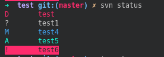
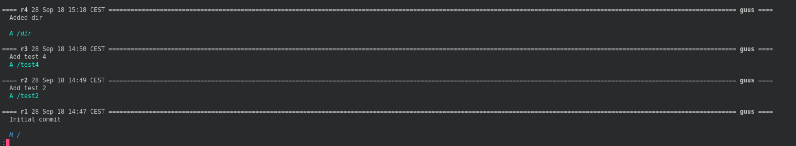
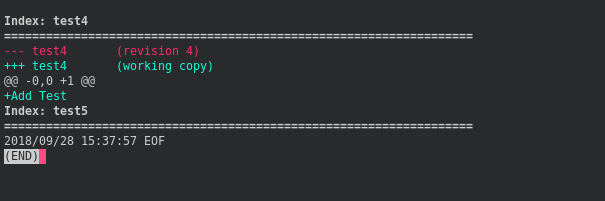

# csvn

SVN commands with output coloring





## Supported commands

* `status/stat`
* `log (-v)`
* `diff`

## `svn_wrapper`

`svn_wrapper` is to be used as an alias for svn which automatically pipes commands such as `diff` and `log` into `less`

The following keeps the existing svn zsh completion intact while using the wrapper script

```sh
function svn {
    svn_wrapper $@
}
```